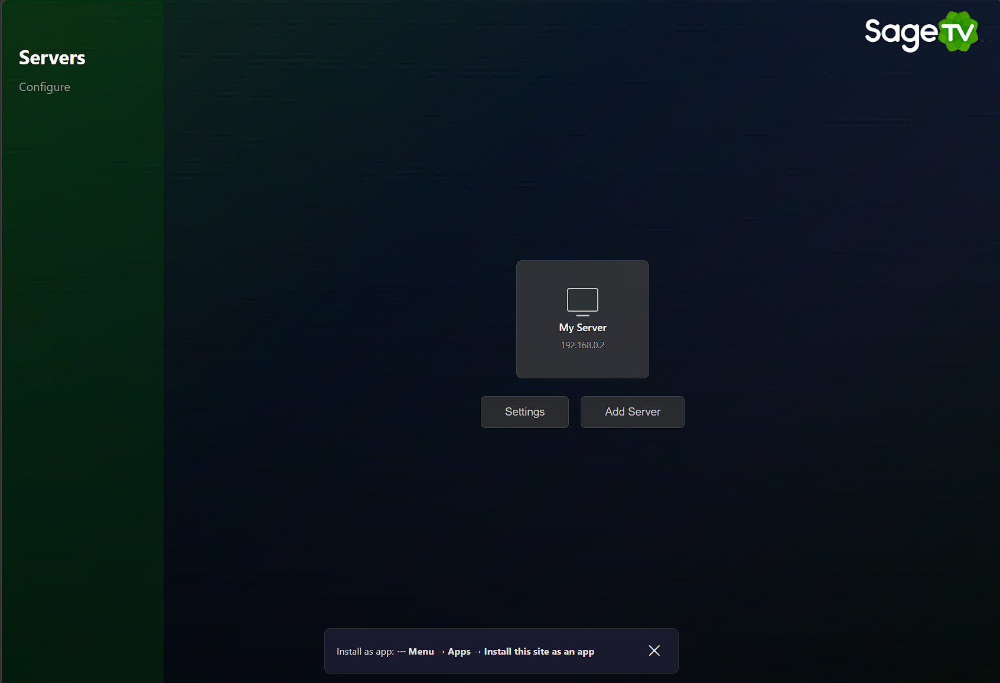

# PWA SageTV MiniClient

An HTML5/PWA implementation of the SageTV MiniClient protocol, enabling browser-based access to SageTV media servers from any device — iPad, PC, Android, and more.

## Features

- **Full SageTV protocol support** — Binary protocol, property negotiation, GFX command rendering
- **Encryption** — RSA key exchange + Blowfish event encryption
- **Compression** — ZLIB streaming decompression
- **Canvas 2D rendering** — Surfaces, transforms, textured drawing, font streaming
- **Input support** — Keyboard, mouse, touch gestures, gamepad, soft keyboard for mobile
- **PWA** — Installable, works offline (service worker), responsive design
- **Authentication** — Optional HTTP Basic Auth for securing access
- **Hardware-accelerated transcoding** — GPU encoding via NVENC, QSV, VAAPI, or VideoToolbox

## Architecture

```
Browser (PWA)          Bridge (Jetty, Java)              SageTV Server
┌─────────────┐       ┌──────────────────────┐          ┌─────────────┐
│  Canvas 2D  │──ws──▶│  BridgeServer :8099  │──tcp──▶  │  :31099     │
│  Input Mgr  │       │  (WebSocket relay)   │          │  MiniUI     │
│  Media      │       │  (Transcode)         │          │             │
└─────────────┘       └──────────────────────┘          └─────────────┘
```

The Java bridge runs as a SageTV plugin (shadow JAR in `JARs/`). It embeds a relocated Jetty 9.x stack for HTTP serving, WebSocket relay, and ffmpeg-based transcoding — all within the SageTV process.

> **Note:** An earlier Node.js bridge implementation (`bridge/ws-bridge.js`) is preserved in the repository for historical reference. It is no longer maintained — use the Java bridge for all deployments.

## Deployment Requirement: the bridge must be co-located with SageTV's media

The bridge does two distinct jobs, and they have different placement rules:

- **Protocol relay** (menu/UI, input): connects to SageTV's MiniClient TCP port (`:31099`) **over the network**. This alone can work from any host.
- **Media delivery** (`/rawmedia`, `/transcode`): the client rewrites the server's pull URL (`stv://…/abs/path`) into `<bridge>/rawmedia?path=<abs path>`, and the bridge opens that path **directly on the local filesystem** (byte-range HTTP for direct-play; ffmpeg against the same path for HD transcode of HEVC/AC-3/etc.).

Because the media endpoints read recordings **by absolute path**, the bridge **must have filesystem access to SageTV's recording directories** — i.e. it must run **on the SageTV host** (or a host that mounts the recording storage at the *identical* paths SageTV uses). The default deployment satisfies this automatically: the bridge ships as an in-process SageTV plugin (`<ServerOnly>true</ServerOnly>`), so it always runs alongside the storage.

> ⚠️ **The Standalone mode below is menu-only unless recordings are mounted at identical paths.** A bridge running on a *different* host than SageTV will relay the UI fine, but every `/rawmedia` and `/transcode` request will fail (file not found) because the recording paths don't exist locally. Use it for UI/protocol development, not media playback, unless you replicate SageTV's storage mounts.

## Quick Start (SageTV Plugin)

### Prerequisites
- SageTV 9.x server with Java 8+
- ffmpeg on `PATH` (for media transcoding)

### Install

1. Build the plugin: `cd bridge-java && ./gradlew shadowJar`
2. Copy `build/libs/pwa-miniclient-bridge-<version>.jar` to `SageTV/JARs/`
3. Optional: extract web assets to `SageTV/pwa-miniclient/public/` only if you want to override embedded assets. The bridge serves embedded `pwa-public/` by default.
  - Do not deploy the PWA app to `SageTV/jetty/webapps/`.
  - The bridge endpoint on `:8099` is served by the plugin itself, not SageTV's Jetty webapps deployer.
4. Register the plugin in `Sage.properties`:
   ```properties
   sagetv_root_plugin_list/pwa-miniclient=pwa-miniclient
   ```
5. Restart SageTV
6. Open `https://{SageTV-IP}:8099` in your browser (accept the local self-signed certificate the first time)

### Plugin Configuration

Configure via the SageTV Plugin Manager UI, or directly in `Sage.properties`:

```properties
pwa_miniclient/port=8099
pwa_miniclient/web_root=                     # blank = auto-detect
pwa_miniclient/ffmpeg_path=                  # blank = 'ffmpeg' on PATH
pwa_miniclient/hwaccel=auto                  # auto|nvenc|qsv|vaapi|videotoolbox|none
pwa_miniclient/username=                     # blank = no auth
pwa_miniclient/password=                     # set both to enable Basic Auth
```

### Authentication

Set a username and password to require HTTP Basic Auth for all PWA endpoints:

1. Open the SageTV Plugin Manager → PWA MiniClient → Settings
2. Set **Username** and **Password**
3. Restart the plugin

When both are set, browsers will prompt for credentials before loading the PWA. Leave either blank to disable authentication (open access).

## Quick Start (Standalone)

The bridge can also run outside SageTV for development:

> ⚠️ **Menu-only unless co-located with SageTV's storage.** A standalone bridge on a different host relays the UI/input fine, but `/rawmedia` and `/transcode` read recordings by absolute path — those requests fail unless the SageTV recording directories are mounted locally at the *identical* paths. See [Deployment Requirement](#deployment-requirement-the-bridge-must-be-co-located-with-sagetvs-media) above. For media playback, deploy the bridge as the in-process SageTV plugin.

```bash
cd bridge-java
./gradlew shadowJar
java -jar build/libs/pwa-miniclient-bridge-<version>.jar \
  --port 8099 \
  --web-root ../public \
  --username <username> \
  --password <password>
```

Open `https://localhost:8099/` and connect to your SageTV server.

## Samsung TV Install

For full Samsung Tizen install/sideload instructions (Developer Mode, `.wgt` packaging, install, and launch), see:

- `deploy/tizen/README.md`

## Project Structure

```
├── bridge-java/                   # Java bridge (primary)
│   ├── build.gradle
│   └── src/main/java/sagex/miniclient/pwa/
│       ├── BridgePlugin.java      # SageTV plugin entry point
│       ├── BridgeServer.java      # Jetty HTTP/WS server + auth
│       ├── BridgeWebSocket.java   # WebSocket-to-TCP relay
│       ├── BridgeMain.java        # Standalone entry point
│       ├── TranscodeServlet.java  # FFmpeg transcode endpoint
│       ├── ServerInfoServlet.java # GPU capability probe API
│       └── HwAccel.java           # Hardware acceleration detection
├── bridge/                        # Node.js bridge (legacy, preserved for reference)
│   └── ws-bridge.js
├── public/                        # PWA static files
│   ├── index.html
│   ├── manifest.json
│   ├── sw.js
│   ├── css/app.css
│   └── js/
│       ├── app.js
│       ├── protocol/              # SageTV protocol engine
│       │   ├── connection.js
│       │   ├── constants.js
│       │   ├── crypto.js
│       │   ├── compression.js
│       │   └── binary-utils.js
│       ├── ui/renderer.js         # Canvas 2D renderer
│       ├── input/input-manager.js # Keyboard/mouse/touch/gamepad
│       ├── media/player.js        # HTML5 media player
│       ├── session/session-manager.js
│       ├── settings/settings-manager.js
│       └── lib/                   # Vendored libraries
│           ├── forge.min.js       # node-forge (RSA)
│           ├── pako.esm.js        # pako (zlib)
│           └── blowfish-tables.js
├── plugin/
│   ├── pwa-miniclient.xml         # SageTV plugin manifest
│   └── screenshot.png
├── package.json                   # Node.js deps (legacy bridge only)
└── build-plugin.sh                # Plugin release packaging
```

## Protocol Support

| Feature | Status |
|---------|--------|
| Handshake | ✅ |
| Property negotiation | ✅ |
| ZLIB compression | ✅ |
| RSA/Blowfish encryption | ✅ |
| GFX drawing commands | ✅ |
| Image loading (raw + compressed) | ✅ |
| Surface compositing | ✅ |
| Transform stack | ✅ |
| Font streaming | ✅ |
| Text rendering (DRAWTEXT) | ✅ |
| Keyboard input | ✅ |
| Mouse/touch input | ✅ |
| Gamepad input | ✅ |
| Soft keyboard (iPad) | ✅ |
| MENU_HINT parsing | ✅ |
| Media playback | 🚧 |
| Reconnection | 🚧 |

## Screenshot



## Hardware-Accelerated Transcoding

The bridge uses ffmpeg to transcode media for browser playback. By default (`hwaccel=auto`), it probes for a GPU encoder at startup and falls back to software (libx264) if none is found.

### Supported GPU Backends

| Backend | GPU | OS | ffmpeg Encoder |
|---------|-----|----|----------------|
| `nvenc` | NVIDIA GeForce/Quadro | Linux, Windows | `h264_nvenc` |
| `qsv` | Intel (integrated/Arc) | Linux, Windows | `h264_qsv` |
| `vaapi` | AMD/Intel | Linux only | `h264_vaapi` |
| `videotoolbox` | Apple Silicon/Intel | macOS | `h264_videotoolbox` |
| `none` | — | All | `libx264` (software) |

### Docker: Enabling GPU Access

Docker containers don't have GPU access by default. You must pass through the GPU device.

**NVIDIA GPU (nvenc):**
```bash
docker run --gpus all ...
```

**AMD/Intel GPU (vaapi):**
```bash
docker run --device /dev/dri:/dev/dri ...
```

For docker-compose, add to your SageTV service:
```yaml
services:
  sagetv-server:
    devices:
      - /dev/dri:/dev/dri          # AMD/Intel VAAPI
```

Check the SageTV server log to verify detection:
```
[HwAccel] Auto-detected: vaapi — VA-API (AMD/Intel GPU)
```

## SageTV Plugin Repo Publishing

1. Build release ZIPs: `cd bridge-java && ./gradlew pluginRelease`
2. Create a [GitHub Release](https://github.com/galeforcesage/PWA_SageTV_MiniClient/releases) tagged `vX.Y.Z`
3. Upload both ZIPs to the release
4. Update `plugin/pwa-miniclient.xml` with the new version, MD5 hashes, and download URLs
5. Fork [sagetv-plugin-repo](https://github.com/OpenSageTV/sagetv-plugin-repo)
6. Copy `plugin/pwa-miniclient.xml` into the `plugins/` directory
7. Submit a Pull Request

## License

Apache 2.0 — see [LICENSE](LICENSE)

## Acknowledgments

Based on the [SageTV MiniClient](https://github.com/OpenSageTV/sagetv-miniclient) Android app.
